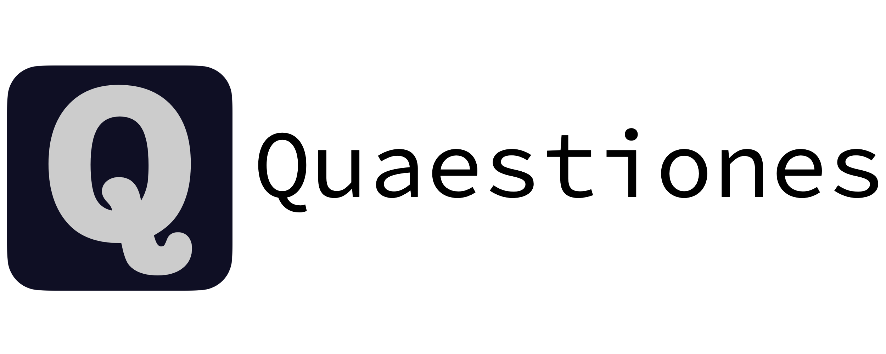

An application that assists you in making a simple questions asking site.

# Features


The above screenshot shows the main page of the Quaestiones website once questions are added.

- You can add as many questions as you like.
- You can customise the "score" for every question. (Or simply remove the scoring system entirely.)
- You can show the number of solves for each question. (Or not. It is up to you.)

After clicking on a question, here's what you would see:


Other than those two, administrators are able to easily add and modify questions on the go via a "Manage Questions"
page:


As well as change how the input for **every question** is generated via an integrated python script:


# Setup

You will need to have [**Python 3.8**](https://www.python.org/downloads/release/python-386/) installed for this software
to work.

1. Download either:
    - [the latest release of Quaestiones](https://github.com/Ryan-Kan/Quaestiones/releases/latest);
    - [the latest stable development build](https://github.com/Ryan-Kan/Quaestiones/archive/main.zip); or
    - [the current development version](https://github.com/Ryan-Kan/Quaestiones/archive/Development.zip)

## Setting Up the Project Folder

2. Extract the contents of the `zip` file into an empty folder. Let's call that folder the *Root Directory*. Rename
   the *Root Directory* as `Quaestiones`.
    - The root directory should have a project structure similar to the following (only some files and folders are
      shown):

```
Quaestiones
├── Assets
│   ├── resources
│   │   ├── css
│   │   │   └── themes
│   │   ├── img
│   │   └── js
│   └── vendors
├── LICENSE
├── Other Files
│   └── Images
├── Quaestiones
│   ├── settings
│   ├── templates
│   │   ├── Quaestiones
│   │   ├── admin
│   │   └── global
├── README.md
├── accounts
├── console
├── misc
├── questions
├── requirements.txt
├── stats
└── uploaded_files_manager
```

3. Inside the *Root Directory*, you should see a folder named `Quaestiones`. Navigate into that folder.
4. Create a new folder inside `Quaestiones` with the name `SecretFiles`.
5. Inside `SecretFiles`, create three files:
   a. `secret.txt`
   b. `email_credentials.yaml`
   c. `github.yaml`
6. Now the project structure should look something like this (not all files and folders are shown):

```
Quaestiones
└── Quaestiones
    └── SecretFiles
        ├── secret.txt
        ├── email_credentials.yaml
        └── github.yaml
```

7. Run the following command and then copy & paste its output into `secret.txt`:

```bash
base64 /dev/urandom | head -c50; echo
```

8. a. Copy and paste the following content into `email_credentials.yaml`:

```yaml
email_use_tls: true
email_host: SMTP_SERVER_HOST
email_user: EMAIL_ADDRESS
email_password: EMAIL_PASSWORD
email_port: SMTP_SERVER_PORT
```

8. b. **Note**: If you are using the GMail SMTP server,
   then [follow this guide](https://dev.to/abderrahmanemustapha/how-to-send-email-with-django-and-gmail-in-production-the-right-way-24ab) (
   especially the section titled "The Gmail part ✉") and thereafter copy and paste this content instead:

```yaml
email_use_tls: true
email_host: smtp.gmail.com
email_user: YOUR_GMAIL_ADDRESS
email_password: YOUR_APP_PASSWORD_FOR_QUAESTIONES
email_port: 587
```

9. Fill in the fields inside `email_credentials.yaml`.
10. Copy and paste the following content into `github.yaml`:

```yaml
current-version-datetime: None
preferred-version: stable
```

11. Change the `preferred-version` to either `release`, `stable` or `development`.
    - `release` means that the server will update only if there is a release version available.
    - `stable` means that the server will update only if there is a new commit on the `main` branch of the Quaestiones
      repository.
    - `development` means that the server will update only if there is a new commit on the `Development` branch of the
      Quaestiones repository.
12. Navigate back to the *Root Directory*.
13. Create the following three folders inside the *Root Directory*. These three folders are to be **kept empty**.
    - `Logs`
    - `StaticFiles`
    - `MediaFiles`

## Setting Up the Server Environment

**Note**: For all commands with `python`, if they do not work, **replace `python` with `python3`**.

14. While inside the *Root Directory*, create a *Virtual Environment* (venv). To do so, run:

```bash
python -m venv venv --prompt Quaestiones
```

15. Activate the venv by running:

```bash
source venv/bin/activate
```

16. Check that your command line looks something like the following (with `Quaestiones` in between the brackets):

```
(Quaestiones) User Quaestiones % 
```

17. Now, install all the project requirements by running:

```
python -m pip install -r requirements.txt
```

## Setting Up The Server Itself

18. We first need to set up the database. Run the command:

```
python manage.py migrate
```

19. Now that we have a database, we are able to create a superuser. Run the following command and follow its prompts:

```
python manage.py createsuperuser
```

20. Start the Quaestiones server by running:

```bash
export DJANGO_SETTINGS_MODULE=Quaestiones.settings.development
python manage.py runserver --noreload 8000
```

21. Now go to [http://127.0.0.1:8000/](http://127.0.0.1:8000/) to see the main page. Try logging in with your username
    and password that you have defined in step 19.

You are done with the setup of the Quaestiones server. Whenever you want to start the server in **production** mode, run
the commands:

```bash
export DJANGO_SETTINGS_MODULE=Quaestiones.settings.production
python manage.py runserver --noreload 8000
```

If you want to run the server in **development** mode instead, run:

```bash
export DJANGO_SETTINGS_MODULE=Quaestiones.settings.development
python manage.py runserver --noreload 8000
```

You can now set up port-forwarding for the server. This document will **not** cover that (primarily because it is *very*
complicated).

# Files You Can Edit

Quaestiones has been made to ensure maximum customability with minimal editing of many different files. As such, it is
essential that **you edit files that can be edited**. Thankfully, that would be **most of the files inside the *Root
Directory***.

However, it is essential that the file named `authenticator` inside `console/console` is **neither edited or removed**.
It is the authentication process of logging into the console.

# Making a Question

## Where to go?

While logged in as an administrator, simply click on the "Manage Questions" tab and then "Create A Question".

## Writing the Description of the Question

The description of the question is the heart of the question itself. Without a good description, the users would likely
be confused or unsure on how to proceed.

The description of the question should be **written in the Markdown language**. A guide to the Markdown language can be
found [here](https://www.markdownguide.org/), and a helpful cheatsheet can also be
found [here](https://www.markdownguide.org/cheat-sheet/).

The full description of the question would likely use a combination of Markdown elements. Regardless whether Markdown
was used, ensure that **your question's descripion is clear, unambiguous, and easily understandable**.

### Images in the Question Description

Images are also helpful in the question description, as a picture would convey a thousand words.

To add a picture, first upload an image file using the "Manage Files" tab (while logged in as an administrator).
Next, **copy the URL of that image file** by clicking on the file name in the "Manage Files" page:


Next, simply replace `URL` in the following line and copy-and-paste this edited line into your question description:

```

```

(Note: If an image does not show up, **remove the domain until the URL starts with the word `media`**. For example, the
URL `127.0.0.1:8000/media/Uploaded-Files/03%20-%20Chessboard%20Infinite.png` would
become `media/Uploaded-Files/03%20-%20Chessboard%20Infinite.png`.)

### Ensuring that the Question Description is Right

Inside the question creation form, there is a small link called "Preview Question".

This page is intended as a place for you to preview your markdown code before actually putting it inside the "Question
Description" field. Please use this page as a guide on how your question would look like on the actual website.

## Input Generation Code

When you are making a question, you would often want to provide the question's input to the user. This can be done
though the questions' management portal.

When editing a question, one of the fields would be `Input Generation Code`. This field is mandatory, and the input of
that field **must follow the following rules**.

First, the code that is in the `Input Generation Code` field **must be in Python 3.8**. This is because the parser of
the code will also be in Python 3.8.
(Note: code from other versions of Python 3 would *likely* be acceptable, however code written in Python 3.9 or later or
code written in Python 2 would **not be accepted**.)

Next, the Input Generation Code must contain the line:

```python
def input_generation():
# Write your code here
```

This is because the server will call this function to generate the input for the users. Note that **the input for every
user can be the same**. It is optional to make it different for every user, but **it is supported**.

Next, the `input_generation` function **must only use built-in python libraries**.

Finally, the `input_generation` function **must return the following two things, in the same order as specified here**:

* **A string** which is the input for the puzzle.
* **Another string** which is the answer for the given input.

This implies that your solution code **must also be contained inside the `input_generation` function**, so that the
correct answer can be generated at the same time as the generation of the input.
(Note: this means that your solution code **must be efficient**.)

Here are some examples:

* The following code **provides the same input** for all users:

```python
def input_generation():  # Copy the function signature EXACTLY
    # This is the input that will be shared for all users
    # Note that the formatting of the input is up to you. You just have to tell
    # the users the input's format.
    input_ = "1, 2, 3, 4, 5, 6, 7"

    # This will be the answer for that input
    answer = "1234567"

    # Return BOTH strings
    return input_, answer
```

* The following code **generates pseudo-random quasi-unique inputs** for every user:

```python
def input_generation():  # Copy the function signature EXACTLY
    # Import BUILT-IN libraries INSIDE the input generation function
    from random import randint

    # This is the input that will be generated for each user
    # NOTE: The input that is generated here is an INTEGER, not a string. So we
    #       must make it a string later.
    input_ = randint(-1000, 1000)

    # This is the solution code
    def solution(integer):
        # Simple function that determines whether the integer is greater than 0
        if integer > 0:
            return "YES"
        else:
            return "NO"

    # Generate the answer based on the generated input
    answer = solution(input_)

    # At this point, only the answer is a string. So we must also make the
    # input a string
    input_ = str(input_)  # Now it satisfies the requirements

    # Return BOTH strings
    return input_, answer
```

You may check your own input generation code using the `Check Input Generation Code.py` file that is in
the `Other Files` directory.

**TL;DR**:

* Input must be in **Python 3.8**
* The first line must contain `def input_generation()`
* The `input_generation` function **must only use built-in python libraries**.
* The function must return two things:
    * **A string** which is the input for the puzzle
    * **Another string** which is the correct answer for the puzzle

# FAQ

## Where should I (an administrator) go to if I require more specific model editing?

You should go to [http://127.0.0.1:8000/admin](http://127.0.0.1:8000/admin) and modify the models there. If that still
does not contain what you need, you should edit the database itself or modify the source code of Quaestiones.
